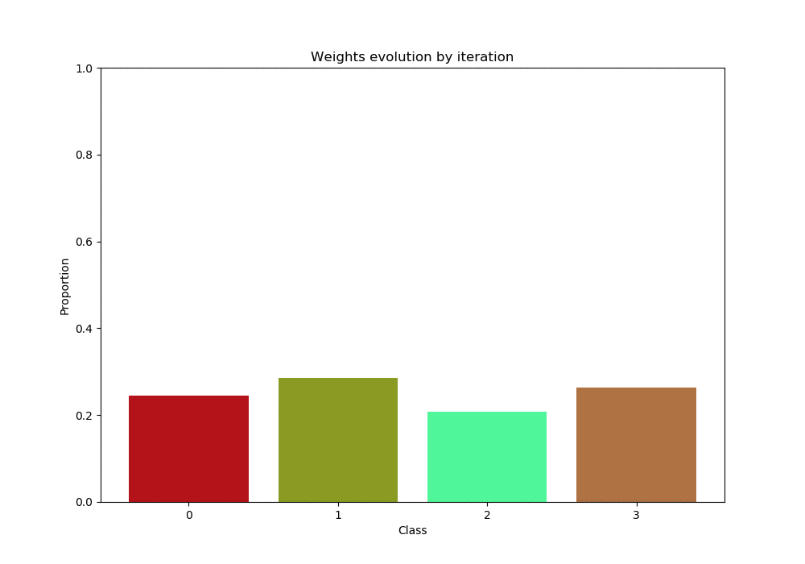
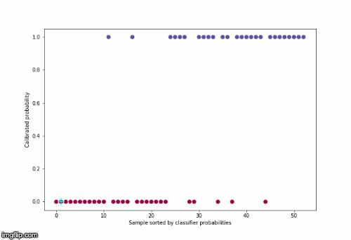

# peacock-ml
The implementation of some of my R&amp;D project.

### 1) How to handle biaised data

Article TBD

### 2) Probability calibration

[Probability calibration article](https://blog.octo.com/calibration-de-probabilite/) (french version)

### 3) Prediction intervals

[Prediction intervals article](https://blog.octo.com/les-intervalles-de-prediction/) (french version)
